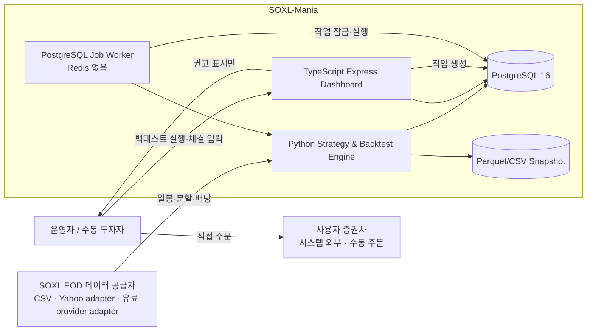
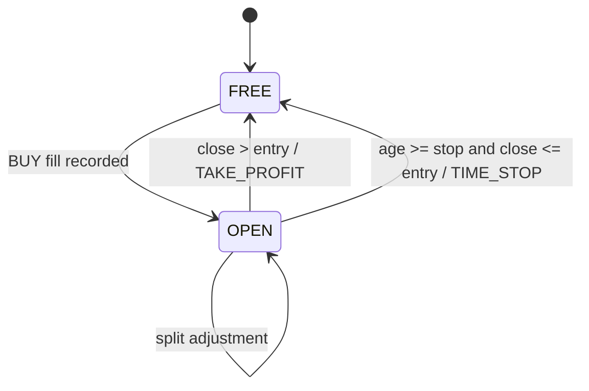

# SOXL-Mania — Codex 구현 계획

> 이 문서는 Codex가 단계별로 구현할 수 있도록 작성한 실행 명세다.  
> **자동 주문·브로커 연동은 범위에서 제외한다.** 시스템은 SOXL 일봉 데이터를 이용해 백테스트하고, 수동 매매를 위한 권고와 장부를 제공한다.

## 0. 가장 중요한 안전 원칙

1. 현재 `Bit-Mania`는 실거래 자동매매 코드와 운영 설정을 포함하므로 **원본 저장소에서 개발하지 않는다**.
2. 새 저장소 `SOXL-Mania`를 생성한 뒤 필요한 구조와 문서 원칙만 이식한다.
3. `.git`, `.env`, API 키, 거래소 설정, 운영 DB 덤프, Redis 비밀번호, Telegram 토큰을 복사하지 않는다.
4. `SOXL-Mania`에는 주문 제출 코드, 브로커 SDK, Redis, 자동매매 실행 엔진을 넣지 않는다.
5. 백테스트 결과와 실제 수동 체결 내역을 분리한다. 시뮬레이션 거래를 실제 체결로 표시하지 않는다.
6. 첨부 스프레드시트 결과와 일치하지 않으면 테스트 기준을 완화하거나 참조값을 수정하지 말고, 차이를 보고한다.

---

# 1. 프로젝트 목표

## 1.1 필수 목표

- SOXL 일봉 종가 기반의 **떨사오팔** 전략 구현
- 자본을 5개, 6개, 7개의 독립적인 **자본 Thread**로 나누어 시뮬레이션
- 10, 30, 40 거래일 손절 조합 지원
- 2011~2024 및 임의 기간 백테스트
- 단리와 풀복리 결과 모두 지원
- 연도별 성과, 누적 성과, MDD, 거래 수, 보유 기간, Thread 상태를 대시보드에서 조회
- 첨부 이미지의 9개 조합을 한 번에 비교하는 매트릭스
- 수동 매매용 오늘의 권고, Thread 장부, 실제 체결 입력, 백업/복원
- PostgreSQL 기반 결과 저장
- Docker Compose로 로컬 실행
- Codex가 한 Phase씩 구현하고 검증할 수 있는 테스트·문서·명령 체계

## 1.2 명시적 비목표

- Redis Pub/Sub
- 자동 주문, 자동 청산, 브로커 API
- Bybit, 암호화폐, 선물, 레버리지 설정 엔진
- Telegram 주문 명령
- 실시간 틱/분봉 전략
- 포트폴리오 다종목 최적화
- 세금 계산, 환율 헤지, 한국 세법 자동 적용
- 첨부 결과를 맞추기 위한 임의의 미래 정보 사용 또는 성과 과최적화

## 1.3 제품 성격

SOXL-Mania는 다음 세 기능으로 한정한다.

1. **Research**: 재현 가능한 백테스트와 파라미터 비교
2. **Decision Support**: 확정된 일봉을 바탕으로 한 수동 매매 권고
3. **Manual Ledger**: 사용자가 직접 입력한 실제 체결과 Thread 상태 관리

---

# 2. Bit-Mania에서 가져올 것과 버릴 것

| Bit-Mania 영역 | SOXL-Mania 처리 | 이유 |
|---|---|---|
| `docs/` C4 계층과 Doc-Sync 원칙 | 유지·단순화 | Codex가 구조와 정본을 빠르게 파악할 수 있음 |
| `backtest/`, `results/`, `dashboards/` 분리 | 유지 | 연구 산출물과 운영 UI 분리 |
| PostgreSQL 16 | 유지 | 결과, 장부, 작업 상태 저장 |
| TypeScript + Express 대시보드 패턴 | 유지 | 기존 코드 스타일 재사용 가능 |
| Docker Compose | 유지 | 개발 환경 재현성 |
| Makefile 진입점 | 유지 | Codex 검증 명령 표준화 |
| Jesse 백테스트 엔진 | 제거 | 미국 주식 EOD, 기업행위, 다중 Thread 상태에 맞춘 전용 엔진이 더 단순하고 검증 가능 |
| `cryptoengine/services/execution/**` | 제거 | 자동 주문 불필요 |
| `strategy-orchestrator` | 제거 | 단일 수동 전략에는 과도함 |
| Redis와 `ioredis` | 제거 | 메시지 버스와 자동매매가 없음 |
| Bybit 커넥터 | 제거 | SOXL 데이터 전용으로 교체 |
| Kill Switch | 제거 | 주문 엔진이 없으므로 불필요; 대신 데이터 품질·중복 체결 방지 검증 적용 |
| Telegram Bot | 제거 | MVP 범위 아님 |
| Prometheus/Grafana | 선택 사항으로 연기 | 로컬 단일 사용자 MVP에는 불필요 |

---

# 3. 전략 정본

## 3.1 조사 결과와 정본 우선순위

검색 가능한 공개 자료에서는 “떨사오팔”의 계산식, Thread 재사용 순서, 연말 처리, 복리 방식까지 고정한 단일 공개 정본을 확인하지 못했다. 따라서 구현 정본의 우선순위는 다음과 같다.

1. 사용자가 설명한 규칙
2. 첨부한 선배의 2011~2024 백테스트 표
3. 아래의 명시적 기본 가정
4. 의미론 보정(parity calibration) 결과와 ADR

공개 자료의 이름만 근거로 숨은 규칙을 임의로 추가하지 않는다.

## 3.2 용어

- **Thread**: 운영체제 스레드가 아니라 독립된 자본 슬롯이다. 코드에서는 `CapitalThread` 또는 `LotThread`를 사용한다.
- **진입가**: 해당 Thread가 SOXL을 산 체결 기준가
- **보유 거래일 수**: 달력일이 아니라 미국 주식 거래 세션 수
- **익절**: 현재 기준 종가가 해당 Thread의 진입가보다 높을 때 청산
- **N손**: N 거래 세션 동안 회복하지 못한 Thread의 강제 손절
- **단리**: 거래 금액을 기준 원금으로 고정하고 손익을 누적하는 모드
- **풀복리**: Thread의 현재 자산을 다음 거래에 재투입하는 모드

## 3.3 기본 전략 규칙 `mentor_v1`

초기 구현은 아래 의미론으로 시작한다. 첨부 표와의 오차를 분석한 뒤 §8의 보정 절차로 확정한다.

1. 자본을 `thread_count`개의 Thread로 나눈다.
2. 첫 거래일에는 전일 종가가 없으므로 신규 진입하지 않는다.
3. 오늘 기준 종가가 전 거래일 기준 종가보다 낮으면 `DOWN_DAY`다.
4. `DOWN_DAY`마다 사용 가능한 Thread가 있으면 **최대 1개 Thread**를 신규 진입시킨다.
5. 각 보유 Thread는 서로 독립적으로 현재 종가와 자신의 진입가를 비교한다.
6. `current_close > entry_price`이면 익절한다.
7. 익절되지 않았고 `holding_sessions >= stop_sessions`이면 손절한다.
8. 손절 예정일에 종가가 진입가보다 높다면 익절이 우선한다.
9. 종가가 진입가와 같으면 익절이 아니다. 손절 시점에는 회복 실패로 간주하여 손절한다.
10. 하루에 여러 Thread가 동시에 익절 또는 손절될 수 있다.
11. 청산을 먼저 처리한 뒤 당일 하락 진입을 처리한다.
12. 기본값에서는 당일 청산된 Thread를 같은 종가에 다시 진입시킬 수 있다.
13. 사용 가능한 Thread가 없으면 진입 신호를 `SKIPPED_NO_FREE_THREAD`로 기록한다.
14. 거래 가격은 설정된 실행 프로필에 따른다.

## 3.4 기본 의사코드

```python
for i, bar in enumerate(bars):
    if i == 0:
        mark_to_market(bar)
        continue

    price = select_price(bar, config.price_basis)
    previous_price = select_price(bars[i - 1], config.price_basis)

    # 1) 각 보유 Thread 청산 판단
    for thread in portfolio.open_threads_in_stable_order():
        age = bar.session_index - thread.entry_session_index

        if price > thread.entry_price:
            close_thread(thread, price, reason="TAKE_PROFIT")
        elif age >= config.stop_sessions and price <= thread.entry_price:
            close_thread(thread, price, reason="TIME_STOP")

    # 2) 하락일 신규 진입: 하루 최대 1개
    if price < previous_price:
        thread = portfolio.select_free_thread(config.thread_selector)
        if thread is None:
            record_skipped_signal("NO_FREE_THREAD")
        else:
            open_thread(thread, price, sizing=config.sizing_mode)

    mark_to_market(bar)
```

## 3.5 반드시 설정 가능해야 하는 의미론 스위치

첨부 표의 세부 공식이 보이지 않으므로 아래 옵션을 하드코딩하지 않는다.

```yaml
strategy:
  id: ddeolsao-pal
  symbol: SOXL
  thread_count: 5
  stop_sessions: 30

  entry_rule: close_lt_previous_close
  max_entries_per_session: 1
  exit_scope: all_profitable_threads
  take_profit_operator: gt
  stop_operator: holding_gte
  profit_precedes_stop: true

  event_order: exits_then_entry
  allow_same_session_thread_reuse: true
  thread_selector: round_robin
  year_boundary: carry
  end_of_test: mark_to_market

  sizing_mode: fixed_principal
  price_basis: adjusted_close
  execution_model: ideal_same_close

costs:
  commission_bps: 0
  slippage_bps: 0
  allow_fractional_shares: true
```

지원할 후보값:

- `thread_selector`: `round_robin`, `lowest_id`, `oldest_free`
- `event_order`: `exits_then_entry`, `entry_then_exits`
- `allow_same_session_thread_reuse`: `true`, `false`
- `year_boundary`: `carry`, `reset`, `force_close`
- `end_of_test`: `mark_to_market`, `force_close`
- `sizing_mode`: `fixed_principal`, `thread_compound`, `portfolio_rebalance_compound`
- `price_basis`: `adjusted_close`, `raw_close_with_actions`
- `execution_model`: `ideal_same_close`, `next_open`, `next_close`, `manual_fill`

## 3.6 실행 모델과 동일 종가 편향

확정 종가를 본 뒤 같은 종가에 체결했다고 가정하면 실제 수동 매매에서는 재현하기 어렵다. 따라서 두 결과를 반드시 분리한다.

| 모델 | 신호 계산 | 체결 | 용도 |
|---|---|---|---|
| `ideal_same_close` | 당일 확정 종가 | 같은 종가 | 첨부 표 재현 전용 |
| `next_open` | 당일 장 마감 후 | 다음 거래일 시가 | 수동 매매 기본 현실 모델 |
| `next_close` | 당일 장 마감 후 | 다음 거래일 종가 | 보수적 비교 모델 |
| `manual_fill` | 권고 생성 | 사용자 입력 가격/수량 | 실제 장부 |

대시보드는 모든 성과 카드에 실행 모델 배지를 표시한다. `ideal_same_close` 결과를 실전 예상 수익으로 표현하지 않는다.

## 3.7 가격 기준과 기업행위

장기 백테스트는 분할과 배당을 무시하면 왜곡된다.

- 참조 재현 기본값: `adjusted_close`
- 실제 수동 장부: `raw_close_with_actions`
- 원본 데이터에 `close`, `adj_close`, `split_ratio`, `dividend`를 모두 저장
- 분할 발생 시 실제 Thread의 수량과 진입가를 역비례 조정하여 손익이 갑자기 변하지 않게 함
- 조정종가 모드에서는 별도 배당 현금 흐름을 중복 반영하지 않음
- 각 백테스트 결과에 `data_hash`, `price_basis`, `corporate_action_mode`를 저장

## 3.8 권장 기본 프로필

| 프로필 | Thread | 손절 | 목적 |
|---|---:|---:|---|
| `mentor_default_5x30` | 5 | 30 | 기본 UI·거래 수 참조가 가장 풍부한 기준 프로필 |
| `mentor_grid_best_avg_5x40` | 5 | 40 | 첨부 표에서 연평균이 가장 높았던 조합의 재현용; 투자 추천 의미 없음 |
| `mentor_low_vol_7x10` | 7 | 10 | 첨부 표에서 연도별 표준편차가 가장 낮았던 조합 비교용 |

대시보드의 “최고” 표시는 단일 수익률이 아니라 MDD, 변동성, 현실 체결 모델을 함께 비교해야 한다.

---

# 4. 첨부 백테스트 참조 데이터

## 4.1 출처 메타데이터

- 파일: `KakaoTalk_20260618_144451348.jpg`
- 이미지 크기: `1280 × 662`
- SHA-256: `d26f8c4c954f18f7f59eb721410d2224a58bf4be778f0941222d4c22f113c928`
- 표기 기간: `2011 ~ 2024-12-31`
- 기준 금액: `$10,000`
- 참조값은 이미지에서 수기로 전사했으므로, Codex 구현 후 한 번 더 사람 검수를 거쳐 fixture를 잠근다.

## 4.2 연도별 단리 수익률 참조표

단위는 `%`다.

| 연도 | SOXL 시작→종료 | SOXL | 5/10 | 5/30 | 5/40 | 6/10 | 6/30 | 6/40 | 7/10 | 7/30 | 7/40 |
|---:|---|---:|---:|---:|---:|---:|---:|---:|---:|---:|---:|
| 2011 | 0.85→0.43 | -49.4 | 39.5 | 29.0 | 31.4 | 32.9 | 24.1 | 26.2 | 28.2 | 20.7 | 22.4 |
| 2012 | 0.45→0.45 | 0.0 | 19.5 | 12.7 | -5.3 | 16.3 | 10.6 | -4.4 | 13.9 | 9.1 | -3.8 |
| 2013 | 0.51→1.15 | 125.5 | 48.8 | 53.1 | 66.6 | 40.7 | 44.2 | 55.5 | 34.9 | 37.9 | 47.6 |
| 2014 | 1.10→2.25 | 104.5 | 26.8 | 48.4 | 48.8 | 22.3 | 40.4 | 40.7 | 19.1 | 34.6 | 34.9 |
| 2015 | 2.25→1.78 | -20.9 | 20.8 | 15.2 | 2.5 | 17.3 | 12.7 | 2.1 | 14.9 | 10.9 | 1.8 |
| 2016 | 1.72→3.81 | 121.5 | 40.2 | 54.9 | 64.0 | 33.5 | 45.8 | 53.3 | 28.7 | 39.2 | 45.7 |
| 2017 | 3.81→9.19 | 141.2 | 29.0 | 39.2 | 39.2 | 24.2 | 32.7 | 32.7 | 20.7 | 28.0 | 28.0 |
| 2018 | 9.95→5.55 | -44.2 | -14.3 | -9.8 | 4.5 | -11.9 | -8.2 | 3.8 | -10.2 | -7.0 | 3.3 |
| 2019 | 5.70→18.32 | 221.4 | 31.3 | 67.7 | 72.1 | 26.1 | 56.5 | 60.1 | 22.4 | 48.4 | 51.5 |
| 2020 | 19.46→31.10 | 59.8 | 34.1 | 66.8 | 70.7 | 28.4 | 55.6 | 58.9 | 24.3 | 47.8 | 50.5 |
| 2021 | 30.67→68.01 | 121.7 | 55.0 | 88.0 | 91.8 | 45.7 | 73.2 | 76.4 | 39.2 | 62.6 | 65.3 |
| 2022 | 72.10→9.36 | -87.0 | 30.9 | 23.9 | 27.8 | 25.7 | 19.9 | 23.2 | 21.9 | 17.1 | 19.9 |
| 2023 | 9.36→28.04 | 199.6 | 46.5 | 71.2 | 71.6 | 38.6 | 59.2 | 59.6 | 33.1 | 50.7 | 51.1 |
| 2024 | 28.04→27.31 | -2.6 | 68.1 | 79.1 | 76.9 | 56.5 | 65.6 | 63.8 | 48.5 | 56.4 | 54.8 |

## 4.3 집계 참조표

| 지표 | 기간 | SOXL | 5/10 | 5/30 | 5/40 | 6/10 | 6/30 | 6/40 | 7/10 | 7/30 | 7/40 |
|---|---|---:|---:|---:|---:|---:|---:|---:|---:|---:|---:|
| 표준편차 | 2011~2024 | — | 19.3 | 28.5 | 31.1 | 16.1 | 23.7 | 25.9 | 13.8 | 20.3 | 22.2 |
| 전체평균 | 2011~2024 | 3112.9 | 34.0 | 45.7 | 47.3 | 28.3 | 38.0 | 39.4 | 24.3 | 32.6 | 33.8 |
| 평균5년 | 2020~2024 | 40.3 | 46.9 | 65.8 | 67.8 | 39.0 | 54.7 | 56.4 | 33.4 | 46.9 | 48.3 |
| 단리전체 | 2011~2024 | 3112.9 | 479.6 | 671.2 | 706.0 | 399.2 | 558.8 | 587.7 | 342.1 | 479.1 | 503.8 |
| 단리5년 | 2020~2024 | 379.1 | 235.7 | 345.5 | 355.4 | 195.9 | 287.4 | 295.6 | 167.8 | 246.4 | 253.4 |
| 단리3년 | 2022~2024 | -11.0 | 151.2 | 195.0 | 196.6 | 125.6 | 162.0 | 163.5 | 107.6 | 139.0 | 140.2 |
| 풀복리전체 | 2011~2024 | 3112.9 | 3850.2 | 5140.0 | 7474.2 | 2907.5 | 4687.2 | 5525.6 | 2290.5 | 5096.3 | 5965.5 |
| 풀복리5년 | 2020~2024 | 379.1 | 673.4 | 903.4 | 810.5 | 468.9 | 755.6 | 690.9 | 377.9 | 932.6 | 1003.9 |
| 풀복리3년 | 2022~2024 | -11.0 | 301.7 | 293.7 | 262.0 | 234.8 | 266.3 | 233.6 | 187.2 | 242.0 | 223.7 |
| 풀복리1년 | 2024 | -2.6 | 106.2 | 133.1 | 128.5 | 86.9 | 107.9 | 104.3 | 70.7 | 87.4 | 84.5 |

## 4.4 연도별 익절/손절 수 참조표

표에 공개된 네 조합만 fixture로 둔다. 형식은 `익절 / 손절`이다.

| 연도 | 5/30 | 6/10 | 6/30 | 7/30 |
|---:|---:|---:|---:|---:|
| 2011 | 127 / 16 | 119 / 24 | 127 / 16 | 127 / 16 |
| 2012 | 127 / 24 | 115 / 36 | 127 / 24 | 127 / 24 |
| 2013 | 121 / 4 | 114 / 11 | 121 / 4 | 121 / 4 |
| 2014 | 108 / 4 | 102 / 10 | 108 / 4 | 108 / 4 |
| 2015 | 109 / 16 | 99 / 26 | 109 / 16 | 109 / 16 |
| 2016 | 113 / 6 | 105 / 14 | 113 / 6 | 113 / 6 |
| 2017 | 99 / 5 | 93 / 11 | 99 / 5 | 99 / 5 |
| 2018 | 99 / 19 | 90 / 28 | 99 / 19 | 99 / 19 |
| 2019 | 105 / 5 | 96 / 14 | 105 / 5 | 105 / 5 |
| 2020 | 112 / 6 | 103 / 15 | 112 / 6 | 112 / 6 |
| 2021 | 114 / 5 | 101 / 18 | 114 / 5 | 114 / 5 |
| 2022 | 114 / 20 | 106 / 28 | 114 / 20 | 116 / 18 |
| 2023 | 110 / 8 | 99 / 19 | 110 / 8 | 110 / 8 |
| 2024 | 116 / 8 | 111 / 13 | 116 / 8 | 116 / 8 |

집계 참조:

| 집계 | 5/30 | 6/10 | 6/30 | 7/30 |
|---|---:|---:|---:|---:|
| 전체평균 | 112 / 10 | 104 / 19 | 112 / 10 | 113 / 10 |
| 평균5년 | 113 / 9.4 | 104 / 19 | 113 / 9 | 114 / 9 |
| 단리전체 | 1603 / 117 | 1471 / 249 | 1603 / 117 | 1603 / 117 |
| 단리5년 | 575 / 38 | 525 / 88 | 575 / 38 | 575 / 38 |
| 단리3년 | 348 / 28 | 320 / 56 | 348 / 28 | 348 / 28 |
| 풀복리전체 | 1345 / 101 | 1435 / 248 | 1435 / 109 | 1497 / 113 |
| 풀복리5년 | 503 / 36 | 513 / 88 | 527 / 38 | 554 / 38 |
| 풀복리3년 | 301 / 27 | 317 / 56 | 319 / 28 | 333 / 28 |
| 풀복리1년 | 112 / 7 | 112 / 12 | 116 / 7 | 117 / 7 |

## 4.5 참조값 해석 주의

- 상단 연도별 표, 단리 누적, 풀복리 누적은 동일한 연말 처리나 Thread 재투자 공식을 사용하지 않았을 수 있다.
- 연도별 시작·종료 종가가 데이터 공급자마다 소수점 반올림 또는 조정 방식 때문에 달라질 수 있다.
- 참조 데이터와 정확히 같은 가격 데이터가 없으면 전략 코드가 맞아도 결과가 달라진다.
- 그러므로 **데이터 일치 검증 → 거래 이벤트 일치 → 수익률 일치** 순으로 검사한다.

---

# 5. 목표 아키텍처

## 5.1 시스템 컨텍스트



## 5.2 컨테이너

| 서비스 | 역할 | 포트 | Redis |
|---|---|---:|---|
| `postgres` | 데이터·결과·수동 장부 | 5432, 기본 localhost 바인딩 | 없음 |
| `engine-worker` | DB 작업 큐 폴링, 백테스트 실행 | 없음 | 없음 |
| `dashboard` | Express REST + 정적 UI | 3000 | 없음 |
| `engine-cli` | 데이터 동기화·백테스트 one-shot | 없음 | 없음 |

작업 큐는 PostgreSQL의 `FOR UPDATE SKIP LOCKED` 또는 advisory lock을 사용한다.

## 5.3 디렉터리 구조

```text
SOXL-Mania/
├── AGENTS.md
├── CLAUDE.md                    # AGENTS.md를 가리키는 짧은 호환 문서
├── README.md
├── Makefile
├── docker-compose.yml
├── .env.example
├── pyproject.toml
├── uv.lock
├── package-lock.json
├── configs/
│   ├── strategies/
│   │   ├── mentor_default_5x30.yaml
│   │   ├── mentor_grid_best_avg_5x40.yaml
│   │   └── mentor_low_vol_7x10.yaml
│   └── providers/
├── docs/
│   ├── _index.md
│   ├── 10-context/system-context.md
│   ├── 20-containers/containers.md
│   ├── 30-components/components.md
│   ├── 40-data/data-model.md
│   ├── 50-api/rest-api.md
│   ├── 60-runtime/state-machines.md
│   ├── 70-policy/strategy.md
│   ├── 70-policy/backtest-methodology.md
│   ├── 70-policy/manual-operations.md
│   └── 90-adr/
├── engine/
│   ├── src/soxl_mania/
│   │   ├── cli.py
│   │   ├── config.py
│   │   ├── domain/
│   │   │   ├── models.py
│   │   │   ├── enums.py
│   │   │   └── money.py
│   │   ├── data/
│   │   │   ├── providers/base.py
│   │   │   ├── providers/csv_provider.py
│   │   │   ├── providers/yahoo_provider.py
│   │   │   ├── normalize.py
│   │   │   ├── calendar.py
│   │   │   └── quality.py
│   │   ├── strategies/
│   │   │   └── ddeolsao_pal.py
│   │   ├── backtest/
│   │   │   ├── engine.py
│   │   │   ├── execution.py
│   │   │   ├── sizing.py
│   │   │   ├── metrics.py
│   │   │   ├── sweep.py
│   │   │   └── parity.py
│   │   ├── persistence/
│   │   │   ├── db.py
│   │   │   ├── repositories.py
│   │   │   └── worker.py
│   │   ├── manual/
│   │   │   ├── ledger.py
│   │   │   ├── recommendation.py
│   │   │   └── reconciliation.py
│   │   └── reporting/
│   │       ├── exports.py
│   │       └── reference_report.py
│   └── tests/
│       ├── unit/
│       ├── property/
│       ├── integration/
│       └── fixtures/
│           └── mentor_reference_2011_2024.json
├── db/
│   ├── alembic.ini
│   └── migrations/
├── dashboard/
│   ├── package.json
│   ├── tsconfig.json
│   ├── src/
│   │   ├── server.ts
│   │   ├── db.ts
│   │   ├── routes/
│   │   │   ├── backtests.ts
│   │   │   ├── data.ts
│   │   │   ├── manual.ts
│   │   │   └── profiles.ts
│   │   └── schemas/
│   └── public/
│       ├── index.html
│       ├── backtests.html
│       ├── compare.html
│       ├── manual.html
│       ├── data.html
│       ├── app.js
│       └── styles.css
├── data/
│   ├── raw/                    # gitignore
│   ├── normalized/             # gitignore
│   ├── snapshots/              # 승인된 소형 스냅샷만 추적 가능
│   └── manifests/
├── results/                    # gitignore; 메타데이터는 DB
└── scripts/
    ├── lint_docs.py
    ├── verify_no_autotrading.py
    └── export_reference_fixture.py
```

## 5.4 기술 선택

### Python 엔진

- Python 3.12 프로젝트 선택
- `pandas`, `pyarrow`: 일봉/Parquet I/O
- `exchange-calendars` 또는 동등한 NYSE 세션 달력
- `pydantic`: 설정·도메인 검증
- `SQLAlchemy` + `Alembic` + `psycopg`: PostgreSQL
- `Typer`: CLI
- `pytest`, `hypothesis`, `ruff`, `mypy`: 품질 게이트
- 통화·수량 핵심 계산은 `Decimal`; 차트·통계 계산에서만 float 변환

### Dashboard

- 기존 Bit-Mania 패턴을 따라 TypeScript + Express + PostgreSQL
- `ioredis` 의존성 제거
- 차트는 로컬 번들된 Plotly.js 또는 동등 라이브러리
- 런타임 외부 CDN 의존 금지
- 한국어 UI 기본, 날짜는 미국 거래일과 KST 표시를 함께 제공

---

# 6. 데이터 모델

## 6.1 핵심 테이블

### `market_bars`

| 컬럼 | 형식 | 설명 |
|---|---|---|
| `symbol` | varchar | `SOXL` |
| `session_date` | date | 미국 거래 세션 날짜, 유일 키 일부 |
| `open/high/low/close` | numeric | 원시 OHLC |
| `adj_close` | numeric | 조정종가 |
| `volume` | bigint | 거래량 |
| `dividend` | numeric | 현금 배당 |
| `split_ratio` | numeric | 2:1이면 2.0 |
| `source` | varchar | 공급자 |
| `source_row_hash` | char(64) | 행 무결성 |
| `import_id` | uuid | 데이터 수입 이력 |

유일 키: `(symbol, session_date, source)`

### `data_imports`

- 공급자, 요청 기간, 수집 시각, 행 수, 결측 수
- 파일 SHA-256, 전체 `data_hash`
- 품질 상태: `PENDING`, `VALID`, `REJECTED`
- 원본 수정 또는 덮어쓰기 금지; 새 버전 추가

### `strategy_profiles`

- 이름, Thread 수, 손절 세션, 가격 기준, 실행 모델
- 단리/복리, 비용, 의미론 스위치 전체를 JSONB와 정규 컬럼으로 저장
- 변경 시 새 버전 생성

### `backtest_jobs`

- `id`, `status`, `requested_at`, `started_at`, `finished_at`
- `config_hash`, `data_hash`, `code_commit`
- `cancel_requested`, `error_message`, `progress`

### `backtest_runs`

- 실행 기간, 초기 자본, 설정 스냅샷
- 실행 모델, 가격 기준, 비용
- 총수익, CAGR, 변동성, Sharpe, Sortino, MDD, Calmar
- 익절/손절/미청산/건너뛴 진입 수
- 결과 산출물 경로와 체크섬

### `backtest_daily`

- 날짜, 현금, 평가액, 총자산, 일수익률, 누적수익률, drawdown
- 보유 Thread 수, 당일 진입/익절/손절/스킵 수
- 기본키 `(run_id, session_date)`

### `backtest_trades`

- `run_id`, `thread_no`
- 진입일/가격/수량, 청산일/가격
- 보유 세션 수, 손익, 수익률
- `TAKE_PROFIT`, `TIME_STOP`, `END_OF_TEST`
- 신호일과 체결일을 별도 저장

### `backtest_yearly`

- 연도별 시작/종료 자산, 수익률, MDD, 익절/손절 수
- 첨부 이미지와 직접 비교할 수 있는 열 포함

### `manual_accounts`, `manual_threads`, `manual_fills`

실제 수동 장부는 백테스트 테이블과 완전히 분리한다.

- Thread별 현재 현금, 수량, 실제 진입가, 진입일
- 사용자가 입력한 주문 방향, 체결 가격, 체결 수량, 수수료
- 수정 이력은 append-only 이벤트로 남김
- 삭제 대신 `reversed_by_fill_id`를 사용

### `recommendations`

- 기준 세션, 생성 시각, 데이터 해시
- Thread별 `BUY`, `TAKE_PROFIT`, `TIME_STOP`, `HOLD`, `NO_ACTION`
- 이유, 기준 가격, 예정 실행 모델
- 실제 주문 여부를 저장하지 않음

## 6.2 상태 머신



수동 체결에서는 권고와 실제 체결이 다를 수 있으므로 `RECOMMENDED` 상태를 Thread 상태에 섞지 않는다.

---

# 7. REST API

## 7.1 데이터

- `GET /api/data/status`
- `POST /api/data/import/csv`
- `POST /api/data/sync`
- `GET /api/data/imports`
- `GET /api/data/bars?start=&end=&basis=`
- `POST /api/data/validate`

## 7.2 전략 프로필

- `GET /api/profiles`
- `GET /api/profiles/:id`
- `POST /api/profiles`
- `POST /api/profiles/:id/clone`
- 기존 실행에 사용된 프로필 버전은 수정하지 않음

## 7.3 백테스트

- `POST /api/backtests`
- `GET /api/backtests`
- `GET /api/backtests/:id`
- `POST /api/backtests/:id/cancel`
- `GET /api/backtests/:id/equity`
- `GET /api/backtests/:id/drawdown`
- `GET /api/backtests/:id/trades`
- `GET /api/backtests/:id/yearly`
- `GET /api/backtests/compare?run_ids=`
- `POST /api/backtests/grid` — 5/6/7 × 10/30/40 생성
- `GET /api/backtests/:id/export?format=csv|json`

## 7.4 수동 장부와 권고

- `GET /api/manual/today`
- `GET /api/manual/threads`
- `POST /api/manual/fills`
- `POST /api/manual/fills/:id/reverse`
- `POST /api/manual/reconcile`
- `GET /api/manual/history`
- `GET /api/manual/export`
- `POST /api/manual/restore` — 명시적 확인 토큰 필요

## 7.5 응답 불변식

모든 백테스트 응답에 다음을 포함한다.

```json
{
  "run_id": "uuid",
  "strategy_profile_version": 3,
  "data_hash": "sha256",
  "code_commit": "git-sha",
  "price_basis": "adjusted_close",
  "execution_model": "ideal_same_close",
  "cost_model": {"commission_bps": 0, "slippage_bps": 0},
  "reference_parity": "PASS|FAIL|NOT_APPLICABLE|DATA_MISMATCH"
}
```

---

# 8. 첨부 표 재현 전략

## 8.1 3단계 parity

### 단계 A — 데이터 parity

- 2011~2024 각 연도의 첫/마지막 기준 종가가 §4.2와 일치하는지 검사
- 분할·배당·조정 방식 확인
- 한 연도라도 기준 가격이 허용 오차를 넘으면 `DATA_MISMATCH`
- 데이터가 다르면 전략 parity를 성공으로 표시하지 않음

### 단계 B — 이벤트 parity

- 공개된 5/30, 6/10, 6/30, 7/30의 연도별 익절/손절 수 비교
- 거래 수는 소수점이 없으므로 exact match가 목표
- 첫 번째 불일치 거래일을 리포트에 표시

### 단계 C — 성과 parity

- 연도별 단리 수익률 9개 조합
- 표준편차, 전체평균, 5년 평균
- 단리 및 풀복리 구간 결과

## 8.2 허용 오차

동일한 데이터 해시일 때:

- 연도별 익절/손절 수: 정확히 일치
- 연도별 수익률: ±0.15 percentage point
- 평균/표준편차: ±0.15 percentage point
- 누적 단리/풀복리: 표가 1자리 반올림이므로 ±1.0 percentage point
- SOXL 첫/마지막 기준 종가: ±0.01

데이터 해시가 다르면 숫자 허용 오차로 억지 통과시키지 않는다.

## 8.3 의미론 보정 도구

`python -m soxl_mania.backtest.parity calibrate` 명령을 만든다.

탐색 대상은 성과 파라미터가 아니라 **해석의 모호성**만 포함한다.

- 조정종가/원시종가
- 청산→진입 또는 진입→청산
- 당일 Thread 재사용 여부
- Round-robin/lowest-id/oldest-free
- 손절 age 포함/미포함
- 연말 carry/reset/force-close
- 종료일 mark-to-market/force-close
- 단리 원금 정의
- 풀복리의 Thread별/포트폴리오 재배분 정의

목적 함수 우선순위:

1. 가격 parity
2. 거래 수 exact match 개수 최대화
3. 연도별 수익률 MAE 최소화
4. 집계 수익률 MAE 최소화

보정 결과는 `docs/90-adr/0001-mentor-semantics.md`에 기록한다. 최종 선택 후 후보 탐색을 실전 최적화 기능으로 노출하지 않는다.

## 8.4 Golden fixture 보호

- `mentor_reference_2011_2024.json`은 검수 후 읽기 전용 취급
- 테스트 실패를 해결하기 위해 fixture 값을 수정하지 않음
- fixture 변경은 별도 커밋, 변경 이유, 이미지 재검수, 소유자 승인 필요
- CI에서 fixture SHA를 검사

---

# 9. 대시보드 요구사항

## 9.1 홈 / 오늘의 권고

- 마지막 확정 SOXL 거래일과 데이터 수집 시각
- 원시 종가, 조정종가, 전일 대비
- 선택 프로필과 실행 모델
- 각 Thread 카드:
  - 상태, 실제 진입일/진입가/수량
  - 현재 평가 손익
  - 보유 거래 세션 수
  - 손절까지 남은 세션
  - 오늘 권고와 이유
- 데이터가 최신이 아니면 큰 `STALE DATA` 경고
- 주문 버튼 없음

## 9.2 백테스트 실행

입력:

- 기간, 초기자본
- 5/6/7 Thread 또는 사용자 정의 1~20
- 10/30/40손 또는 사용자 정의
- 단리/풀복리
- 실행 모델
- 가격 기준
- 수수료/슬리피지
- 연말/종료 처리

출력:

- 총수익, CAGR, MDD, Sharpe, Sortino, 승률
- 익절/손절 수, 평균·최대 보유 세션
- 진입 스킵 수와 최대 동시 보유 Thread
- SOXL Buy & Hold 비교
- equity curve, drawdown curve
- 연도별 수익률 표/히트맵
- Thread별 보유 타임라인
- 거래 테이블과 CSV export

## 9.3 9개 조합 비교

- 행: 연도
- 열: 5/10, 5/30, 5/40, 6/10, 6/30, 6/40, 7/10, 7/30, 7/40
- 첨부 표와 같은 형태의 수익률 매트릭스
- 셀마다 참조값, 계산값, 차이 표시 토글
- 단리, 풀복리, `ideal_same_close`, `next_open` 전환
- 단일 “최고” 라벨 대신 수익률·MDD·표준편차의 Pareto 표시

## 9.4 수동 장부

- 실제 BUY/SELL 체결 입력 폼
- Thread 선택 또는 자동 제안
- 수량, 가격, 수수료, 체결 시각
- 권고와 실제 체결의 차이
- 장부 재조정은 역분개 방식
- JSON/CSV 전체 백업과 복원 검증

## 9.5 데이터 품질

- 누락 거래일
- 중복 날짜
- 비정상 OHLC
- 분할/배당 이벤트
- 최근 데이터 신선도
- 데이터 해시와 공급자
- 백테스트별 사용 데이터 버전

---

# 10. Codex 구현 Phase

각 Phase는 독립 커밋 또는 PR로 끝낸다. 다음 Phase로 넘어가기 전에 Gate를 통과한다.

## Phase 0 — 안전한 새 저장소 부트스트랩

### 작업

- [ ] `SOXL-Mania` 새 저장소 생성
- [ ] Bit-Mania의 라이브 코드나 Git 이력을 직접 복제하지 않고 필요한 문서 구조만 이식
- [ ] `AGENTS.md`, `docs/_index.md`, `README.md`, `Makefile` 생성
- [ ] Python/Node/Docker 기본 구조 생성
- [ ] `.env.example` 작성, 실제 비밀값 없음
- [ ] Redis, Bybit, Telegram, order execution 금지 검사 스크립트 생성
- [ ] GitHub Actions 또는 동등 CI 기본 구성

### 필수 검사

```bash
make bootstrap-check
make lint-docs
python scripts/verify_no_autotrading.py
```

### Gate

- 저장소에서 `BYBIT_API_SECRET`, `REDIS_URL`, `order:request`, 브로커 주문 메서드가 검출되지 않음
- 빈 테스트가 아니라 최소 smoke test 존재
- Docker Compose에는 `postgres`, `dashboard`, `engine-worker`만 존재

### 권장 커밋

`chore: bootstrap SOXL-Mania research and manual-trading stack`

---

## Phase 1 — 데이터 파이프라인과 거래 달력

### 작업

- [ ] `MarketBar`, `CorporateAction`, `DataImport` 모델
- [ ] CSV provider 구현
- [ ] Yahoo adapter는 선택 사항으로 구현하되 CSV snapshot을 정본으로 사용할 수 있게 함
- [ ] 미국 거래 세션 달력 적용
- [ ] 조정종가와 원시종가 보존
- [ ] 데이터 품질 검사와 SHA-256 manifest
- [ ] PostgreSQL migration
- [ ] CLI: `data import`, `data sync`, `data validate`, `data status`

### 필수 테스트

- [ ] 주말/휴일은 거래 세션으로 세지 않음
- [ ] 중복 날짜 거부
- [ ] `low <= open/close <= high` 검증
- [ ] 분할 조정 불변식
- [ ] 같은 입력 파일은 같은 data hash
- [ ] 수정된 한 행은 다른 data hash

### Gate

```bash
make migrate
make test-data
uv run soxl-mania data validate --symbol SOXL
```

### 권장 커밋

`feat(data): add versioned SOXL EOD and corporate-action pipeline`

---

## Phase 2 — Thread 도메인과 전략 상태 머신

### 작업

- [ ] `CapitalThread`, `PortfolioState`, `StrategyConfig`, `Trade` 구현
- [ ] Decimal 기반 자산 계산
- [ ] 기본 `mentor_v1` 전략 구현
- [ ] 의미론 스위치 구현
- [ ] 단리와 Thread별 복리 sizing 구현
- [ ] 일별 이벤트 로그 생성

### 필수 단위 테스트

1. 첫 거래일에는 진입하지 않는다.
2. 하락일에 무료 Thread 하나만 진입한다.
3. 모든 Thread가 사용 중이면 진입을 건너뛴다.
4. 종가가 진입가보다 높으면 익절한다.
5. 종가가 진입가와 같으면 익절하지 않는다.
6. N번째 보유 세션에서 미회복이면 손절한다.
7. 손절일에 가격이 회복되면 익절이 우선한다.
8. 여러 Thread가 같은 날 청산될 수 있다.
9. 설정에 따라 당일 청산 Thread 재사용 여부가 달라진다.
10. 분할은 경제적 손익을 바꾸지 않는다.
11. 같은 입력과 설정은 byte-stable 이벤트 로그를 만든다.

### Property test

- 총자산 = 현금 + 모든 Thread 시장가치
- 수량과 현금은 음수가 될 수 없음
- Thread는 동시에 `FREE`와 `OPEN`일 수 없음
- 하나의 Thread에는 한 개의 열린 lot만 존재

### Gate

```bash
make test-strategy
make typecheck
```

### 권장 커밋

`feat(strategy): implement deterministic ddeolsao-pal thread state machine`

---

## Phase 3 — 백테스트 엔진과 지표

### 작업

- [ ] 이벤트 기반 일봉 엔진
- [ ] `ideal_same_close`, `next_open`, `next_close`
- [ ] 수수료·슬리피지
- [ ] mark-to-market 일별 자산곡선
- [ ] 연도별 reset/carry/force-close
- [ ] 9개 조합 sweep
- [ ] 핵심 성과 지표
- [ ] Parquet/JSON/CSV 산출물

### 필수 지표

- Total return, CAGR
- 연도별 수익률
- 연도별 표준편차
- Volatility, Sharpe, Sortino
- MDD, Calmar, drawdown duration
- 익절/손절/미청산 수
- 평균/중앙/최대 보유 세션
- 진입 스킵 수
- 자본 사용률과 현금 비중
- SOXL Buy & Hold 비교

### Gate

```bash
make test-backtest
uv run soxl-mania backtest run \
  --profile configs/strategies/mentor_default_5x30.yaml \
  --start 2020-01-01 --end 2024-12-31
uv run soxl-mania backtest grid --threads 5,6,7 --stops 10,30,40
```

### 권장 커밋

`feat(backtest): add deterministic EOD engine, metrics, and parameter grid`

---

## Phase 4 — 선배 표 fixture와 parity 보정

### 작업

- [ ] §4 값을 JSON fixture로 변환
- [ ] 이미지 SHA와 전사 버전 저장
- [ ] 데이터 parity 검사
- [ ] 이벤트 parity 검사
- [ ] 성과 parity 검사
- [ ] 의미론 보정 CLI
- [ ] 첫 불일치 세션 상세 리포트
- [ ] 최종 의미론 ADR 작성

### Gate

```bash
make reference-check
uv run soxl-mania parity report --reference mentor-2011-2024
```

성공 조건:

- 데이터 일치 여부가 명시됨
- 거래 수가 일치하지 않으면 첫 불일치 원인을 출력
- 참조와 다른 데이터로 `PASS`를 만들지 않음
- 최종 프로필이 `mentor_v1`로 버전 고정됨

### 권장 커밋

`test(reference): add mentor-sheet parity harness and locked semantics`

---

## Phase 5 — PostgreSQL 결과 저장과 작업 Worker

### 작업

- [ ] §6 테이블 migration
- [ ] backtest job 생성·잠금·실행·실패 처리
- [ ] `FOR UPDATE SKIP LOCKED` 또는 advisory lock
- [ ] config/data/code hash로 중복 실행 캐시
- [ ] 진행률과 취소 요청
- [ ] 결과를 DB와 파일 양쪽에 저장
- [ ] Worker 재시작 후 `RUNNING` orphan 복구

### 필수 통합 테스트

- 두 Worker가 같은 job을 중복 실행하지 않음
- 동일 hash의 완료 run은 재사용 가능
- 실패 job은 error와 traceback 요약을 보존
- 재시작 시 orphan job이 `QUEUED` 또는 `FAILED`로 정리됨

### Gate

```bash
make test-integration
make worker-smoke
```

### 권장 커밋

`feat(persistence): add PostgreSQL backtest jobs and reproducible run storage`

---

## Phase 6 — Dashboard 백테스트 화면

### 작업

- [ ] Express 서버에서 Redis 제거 확인
- [ ] §7 데이터/프로필/백테스트 API
- [ ] 백테스트 목록·상세·비교 화면
- [ ] 9개 조합 매트릭스
- [ ] equity/drawdown/yearly/thread timeline 차트
- [ ] 참조값 대비 차이 표시
- [ ] CSV/JSON export
- [ ] 데이터 신선도·실행 모델 배지

### Gate

```bash
make dashboard-build
make dashboard-test
make e2e-backtest
```

Playwright 핵심 흐름:

1. 프로필 선택
2. 백테스트 요청
3. 완료 상태 확인
4. 연도별 표와 equity curve 표시
5. export 다운로드

### 권장 커밋

`feat(dashboard): visualize SOXL backtests, grid comparison, and parity`

---

## Phase 7 — 수동 매매 장부와 오늘의 권고

### 작업

- [ ] 수동 계정/Thread/fill event migration
- [ ] 실제 BUY/SELL 입력
- [ ] 역분개
- [ ] 현재 Thread 상태 계산
- [ ] 확정 일봉 기반 권고 생성
- [ ] 권고와 실제 체결 차이 표시
- [ ] JSON/CSV 백업·복원
- [ ] 주문 실행 코드가 없다는 정적 검사 강화

### Gate

```bash
make test-manual
make e2e-manual
python scripts/verify_no_autotrading.py
```

필수 시나리오:

- 권고만 생성되고 주문은 발생하지 않음
- 실제 체결가가 권고 기준가와 달라도 장부가 정확함
- 분할 후 기존 Thread가 올바르게 조정됨
- 역분개 후 자산과 audit trail이 복원됨

### 권장 커밋

`feat(manual): add recommendation-only workflow and auditable fill ledger`

---

## Phase 8 — 현실 체결 비교와 리스크 화면

### 작업

- [ ] `ideal_same_close` 대 `next_open` 성과 비교
- [ ] gap risk, 비용 민감도, 데이터 지연 영향
- [ ] Thread 수/손절일의 민감도
- [ ] MDD와 회복 기간 강조
- [ ] 결과 화면에 “투자 조언 아님”과 레버리지 ETF 위험 고지

### Gate

```bash
make scenario-report
make e2e-risk
```

### 권장 커밋

`feat(risk): compare reference close fills with realistic manual execution`

---

## Phase 9 — 운영 경화와 v1.0

### 작업

- [ ] 전체 문서 동기화
- [ ] DB backup/restore runbook
- [ ] localhost 기본 바인딩
- [ ] API key 또는 로컬 세션 인증
- [ ] rate limit과 입력 검증
- [ ] full CI, dependency lock, SBOM 선택
- [ ] 샘플 데이터로 clean-room 설치 검증
- [ ] v1.0 release notes

### 최종 Gate

```bash
make clean-room
make ci
make reference-check
make e2e
make backup-restore-test
```

### 권장 커밋

`release: SOXL-Mania v1.0 manual decision-support and backtesting`

---

# 11. 테스트 전략

## 11.1 테스트 피라미드

| 계층 | 목적 | 네트워크 |
|---|---|---|
| Unit | 상태 머신, sizing, 비용, 지표 | 금지 |
| Property | 회계 불변식, 결정성 | 금지 |
| Golden | 작은 고정 OHLC fixture 이벤트 로그 | 금지 |
| Reference | 첨부 표 parity | 고정 snapshot 사용 |
| Integration | PostgreSQL migration/job/장부 | 로컬 컨테이너 |
| E2E | Dashboard 사용자 흐름 | 로컬 컨테이너 |
| Provider smoke | 외부 데이터 adapter | 수동 실행, CI 기본 제외 |

## 11.2 필수 회귀 케이스

- 5일 연속 하락으로 5개 Thread 모두 점유
- 6번째 하락일 진입 스킵
- 한 상승일에 복수 Thread 익절
- 30번째 세션 손절 경계
- 손절일에 회복한 Thread의 익절 우선
- 연말을 가로지르는 포지션
- 조정종가와 원시종가+분할 처리의 경제적 동등성
- 다음 시가 모델에서 신호일 종가가 체결가로 사용되지 않음
- 데이터 수정 후 이전 run의 data hash가 변하지 않음
- 수동 fill 역분개

## 11.3 품질 기준

- 전략 핵심 모듈 branch coverage 95% 이상
- 전체 Python coverage 85% 이상
- TypeScript 핵심 route/schema coverage 80% 이상
- `ruff`, `mypy`, `tsc --noEmit`, ESLint 모두 통과
- 테스트에서 현재 날짜나 네트워크에 의존하지 않음
- 난수 사용 시 seed와 설정 저장

---

# 12. Makefile 계약

Codex는 다음 명령을 안정된 공개 인터페이스로 유지한다.

```makefile
bootstrap-check
data-import
data-validate
migrate
backtest-reference
backtest-grid
reference-check
worker
dashboard
test
test-data
test-strategy
test-backtest
test-manual
test-integration
e2e
lint
typecheck
lint-docs
ci
clean-room
backup
restore-test
```

`make ci`는 외부 네트워크 없이 완료되어야 한다.

---

# 13. AGENTS.md 초안

새 저장소 루트에 아래 내용을 기반으로 `AGENTS.md`를 만든다.

```markdown
# SOXL-Mania Agent Guide

## Read first
1. docs/_index.md
2. docs/70-policy/strategy.md
3. SOXL_MANIA_CODEX_IMPLEMENTATION_PLAN.md

## Product boundary
- Research, dashboard, and manual ledger only.
- Never add broker order submission, automatic trading, Redis, Bybit, or Telegram trading commands.
- A recommendation is not a fill. Keep simulated and manual records separate.

## Reference integrity
- Do not edit mentor reference fixtures to make tests pass.
- Do not claim parity when data_hash differs.
- Log the first mismatching session and document semantic changes in an ADR.

## Engineering rules
- Use Decimal for money and quantity in the core engine.
- Count holding age with exchange sessions, not calendar days.
- Every run stores config_hash, data_hash, and code commit.
- No network in unit, property, golden, or reference tests.
- PostgreSQL is the only shared runtime store; no Redis.
- Update docs in the same commit as code.

## Workflow
- Work on one plan Phase at a time.
- Do not implement later-phase features unless required by the current Phase.
- Run the Phase Gate commands and include results in the final task summary.
- Never skip or weaken failing tests.
```

`CLAUDE.md`는 별도 규칙을 중복 작성하지 말고 `AGENTS.md`와 `docs/_index.md`를 읽으라고 안내한다.

---

# 14. Codex 실행 프롬프트 템플릿

각 Phase 작업을 시작할 때 아래 템플릿을 사용한다.

```text
Repository: Justant-source/SOXL-Mania
Plan: SOXL_MANIA_CODEX_IMPLEMENTATION_PLAN.md
Target phase: Phase <N> — <name>

Before editing:
1. Read AGENTS.md.
2. Read docs/_index.md and the documents linked for this phase.
3. Inspect the existing code and tests; do not assume the plan is already implemented.

Scope:
- Implement only the unchecked tasks in Phase <N>.
- Preserve the no-Redis, no-broker, no-auto-order boundary.
- Do not modify locked mentor reference values to satisfy tests.
- Keep simulated backtests and manual fills separate.

Required work:
- Add or update code, migrations, tests, and matching docs.
- Run every Gate command listed for Phase <N>.
- Fix failures rather than weakening checks.

Final response:
- Summarize changed files and design decisions.
- Report exact test commands and results.
- List remaining risks or reference mismatches.
- Do not claim completion if a Gate failed.
```

## 14.1 첫 Codex 작업 권장 프롬프트

```text
Implement Phase 0 from SOXL_MANIA_CODEX_IMPLEMENTATION_PLAN.md.
Treat the existing Bit-Mania repository only as a read-only architectural reference.
Create a clean SOXL-Mania skeleton with AGENTS.md, C4 docs index, Python engine package,
TypeScript Express dashboard, PostgreSQL-only Docker Compose, Makefile gates, and a
static verification script that fails if Redis, Bybit, Telegram trading, or broker order
submission code is introduced. Do not add strategy logic yet. Run all Phase 0 gates.
```

## 14.2 전략 구현 작업 권장 프롬프트

```text
Implement Phase 2 only. Build the deterministic CapitalThread state machine and
mentor_v1 rules exactly as documented. Use exchange session indices and Decimal.
Add table-driven unit tests and Hypothesis invariants. Do not access the network,
PostgreSQL, dashboard, or reference image in the core strategy tests. Run the Phase 2 gates.
```

## 14.3 참조 재현 작업 권장 프롬프트

```text
Implement Phase 4 only. Convert the transcribed mentor tables into a locked JSON fixture,
validate the source-image SHA metadata, and build data/event/performance parity reports.
Do not change strategy semantics silently. When a mismatch occurs, report the first session
and compare only the documented ambiguity switches. Record the selected semantics in an ADR.
Never mark parity PASS when the data hash or annual boundary prices do not match.
```

---

# 15. Definition of Done

SOXL-Mania v1.0은 아래 조건을 모두 만족해야 한다.

- [ ] 원본 Bit-Mania 운영 저장소와 비밀정보를 건드리지 않음
- [ ] Redis 의존성 0개
- [ ] 브로커/거래소 주문 제출 코드 0개
- [ ] SOXL EOD 데이터가 버전·해시와 함께 저장됨
- [ ] 5/6/7 Thread × 10/30/40손 9개 조합 실행 가능
- [ ] 단리와 풀복리 모두 지원
- [ ] 동일 종가 참조 모델과 다음 시가 현실 모델이 분리됨
- [ ] 첨부 표의 가격/거래 수/성과 parity 상태가 명시됨
- [ ] 데이터 불일치 시 거짓 PASS가 없음
- [ ] 백테스트 결과를 대시보드에서 조회·비교·내보내기 가능
- [ ] 오늘의 권고와 실제 수동 체결 장부가 분리됨
- [ ] Thread별 보유일, 손절 예정, 손익 확인 가능
- [ ] 장부 백업/복원과 역분개 가능
- [ ] `make ci`, `make reference-check`, `make e2e` 통과
- [ ] clean-room Docker 설치 문서 검증
- [ ] 전략 정본과 모호성 해소 ADR 완료

---

# 16. 구현 중 확인이 필요한 최종 의사결정

Codex는 아래 항목을 추측으로 영구 고정하지 말고 parity 결과를 제시한 뒤 ADR로 확정한다.

1. 하락일 진입이 전일 종가 대비 하락인지, 다른 기준인지
2. 하루에 익절 가능한 Thread의 범위가 전체인지 1개인지
3. 당일 청산 Thread를 같은 종가에 재사용하는지
4. Thread 선택 순서
5. 30손의 경계가 `age >= 30`인지 `age > 30`인지
6. 연도별 표가 연초 Thread reset인지, 전년도 포지션 carry인지
7. 연말 미청산 포지션을 평가만 하는지 강제 청산하는지
8. 단리의 고정 원금이 Thread별인지 포트폴리오별인지
9. 풀복리가 Thread별 재투자인지 매 거래 전체 재배분인지
10. 이미지 계산에 사용된 정확한 SOXL 데이터 공급자와 조정 방식

현재 기본값은 §3.3과 §3.5를 따른다. 기본값과 첨부 표가 다르면 “코드를 표에 맞추는” 것이 아니라, 거래 이벤트를 비교해 어떤 의미론 차이인지 증명한 뒤 변경한다.

---

# 17. 최종 권장 구현 순서 요약

```text
새 저장소 안전 부트스트랩
  → 데이터·거래 달력
  → 순수 Thread 상태 머신
  → 백테스트·지표
  → 첨부 표 parity
  → PostgreSQL 작업/결과 저장
  → 백테스트 대시보드
  → 수동 장부·오늘의 권고
  → 현실 체결·리스크 비교
  → 운영 경화와 v1.0
```

가장 먼저 성과 화면을 만드는 대신, **데이터 해시와 순수 상태 머신을 먼저 고정**한다. 그래야 첨부 표 재현 여부와 실제 수동 운용 결과를 신뢰할 수 있다.
